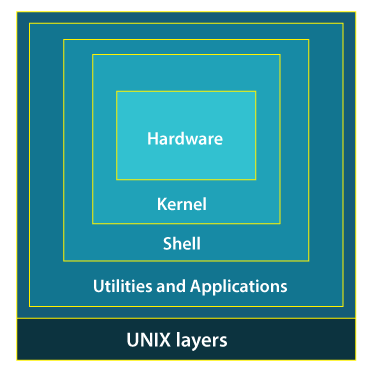

# LINUX 101

## İçindekiler
- [LINUX 101](#linux-101)
  - [İçindekiler](#i̇çindekiler)
  - [Başlarken](#başlarken)
  - [AWS Hizmeti İle Instance Oluşturma](#aws-hizmeti-i̇le-instance-oluşturma)
    - [PuTTy ile key pair dönüştürme](#putty-ile-key-pair-dönüştürme)
    - [PuTTy ile bağlanma](#putty-ile-bağlanma)
  - [Linux/Unix Notları](#linuxunix-notları)
    - [Unix Yapısı](#unix-yapısı)
    - [Unix Dizin Sistemi](#unix-dizin-sistemi)
      - [Dizin İşlevleri](#dizin-i̇şlevleri)
      - [/etc dizini](#etc-dizini)
      - [/dev dizini](#dev-dizini)
      - [/usr dosya sistemi](#usr-dosya-sistemi)
      - [/var dosya sistemi](#var-dosya-sistemi)
      - [/proc dosya sistemi](#proc-dosya-sistemi)
  - [Bash Scripting](#bash-scripting)
  - [Kaynaklar](#kaynaklar)
## Başlarken

Bu bölümde server kullanırken ihtiyaç duyabileceğimiz püf noktalar, komut satırları ve uygulamalar hakkında konuşacağız. Görüş ve geri bildirimlerinizi  issues kısmından bildirirseniz, bana ve öğrenmek isteyenlere yardımcı olabilirsiniz.

## AWS Hizmeti İle Instance Oluşturma

Bu hizmeti kullanabilmek için öncelikle AWS konsolunuza giriş yapmalısınız.

Konsolunuza giriş yaptıktan sonra **Services** sekmesinin altından **Compute** sekmesine ve Compute sekmesi altından **EC2** sekmesine giriyoruz. Bu sekmenin içerisinden **Launch instance** sekmesine geçiş yapıyoruz. Yani yolumuz şu şekilde:
> Services->Compute->EC2->Launch instance

Artık bu sekme üzerinden kendimize bir instance yani bir makine oluşturabiliriz.  Burada oluşturulması gösterilen makine **Ubuntu 18.4** içermekte ve ilerleyen safhalarda Ubuntu'nun bu sürümüne yönelik yönergeler yer almaktadır. Şimdi aşağıdaki adımları izleyelim:

**!** Buradaki adımlar, AWS'nin ücretsiz sağladığı hizmetler çerçevesinde şekillenmiştir.  İşletim sistemi dışındaki seçenekler ihtiyaca göre şekillendirilebilir.

1. Öncelikle isimlendirmemizi yapıyoruz:

   ]

2. Makinemizin işletim sistemini seçiyoruz:

   

3. Instance typemızı seçiyoruz:

   

4. AWS üzerinde root kullanıcımız için direkt şifre oluşturamıyoruz, bu nedenle makinemize bağlabilmek için bir key pair almamız gerekiyor:

   

5. Key pairi oluştururken dikkat etmemiz gereken noktalardan bir tanesi .ppk uzantılı şekilde oluşturmaktır. Eğer key pairinizi .ppk uzantılı oluşturmadıysanız bir sonraki bölümde .pem uzantısından .ppk uzantısına dönüşüm için gerekli adımlar belirtilecektir. (Resimde yanlış belirtilmiş, düzelteceğim.)

   ]

6. Eğer Summary bölümünüz aşağıda bulunan resimdeki gibiyse artık instancemizi başlatabiliriz:

   

### PuTTy ile key pair dönüştürme

Aşağıdaki adımları izleyerek .pem uzantılı key pairimizi .ppk uzantılı hale çevireceğiz. Bu adımlara geçmeden  önce PuTTy edinmeniz gerekmektedir:

1. PuTTygen'e giriş yapalım

2. Load sekmesi ile AWS'den edindiğimiz .pem uzantılı keyimizi açıyoruz ve generate işlemi ile .ppk uzantılı dosyaya çeviriyoruz:

   

3. Save public key diyerek keyimizi bildiğimiz bir konuma kaydedelim.

### PuTTy ile bağlanma

Aşağıdaki adımları izleyerek .ppk uzantılı keyimizi kullanarak serverimize gireceğiz, key ile login işlemini kaldıracağız ve password ile logine izin vereceğiz ardından root için şifre oluşturacağız:

1. Ip adresimizi bu bölüme yazalım:

   

2. **Connection/SSH/Auth** sekmesine geçiş yapalım ve keyimizi indirdiğimiz konumu seçelim ardından open ile onaylayalım:

   

3. Açılan terminalde aşağıdaki gibi devam edelim:
`login as: ubuntu`

4. `sudo nano /etc/ssh/sshd_config`
komutu ile ssh_config dosyasını düzenleme işlemini başlatalım.

5. Düzenlemeye açılan sshd_config dosyasının
`PasswordAuthentication yes`
haline getirelim.
Ardından boş herhangi bir satıra:
`PermitRootLogin yes`
izinini ekleyelim.

6. Ctrl + X ile düzenleme işlemini kaydedelim.

7. Aşağıdaki komut ile root için şifre oluşturalım:
`sudo passwd root`

8. İzinleri değiştirdiğimiz için
`sudo service sshd restart`
veya
`sudo systemctl restart sshd`
komutlarınan  bir tanesiyle sshd hizmetimizi yeniden başlatıyoruz.

9. Aşağıdaki komutla sistem güncellemelerini indirelim. Ayriyetten bu işlemi her giriş yaptığımızda yapmaya çalışalım:
`sudo apt update && sudo apt upgrade -y`

   **!** Buradan sonraki adımlara, kullanıcı eklemek isterseniz devam edebilirsiniz.

10. Aşağıdaki komutla user-name isimli bir user oluşturalım.
`sudo adduser user-name`

11. Aşağıdaki komutla isterseniz ilgili kullanıcıya root yetkilerini kullanmasına izin verebilirsiniz:
`sudo usermod -aG sudo user-name`

12. Bu komutla user-name adlı kullanıcıya şifre belirleyelim:
`sudo passwd user-name`

Bu adımlar ile şifre ile erişim için makinemizin ayarlarını düzenledik. Artık Windows için herhangi bir SSH clienti kullanarak, MacOS veya Linux için kendi konsolunuza  `ssh root@ip-adsress` yazarak bağlantı kurabilirsiniz.

## Linux/Unix Notları

### Unix Yapısı

* Unix mantıksal olarak çok katmanlı bir sistemdir.



[Resim 1.1](https://static.javatpoint.com/linux/images/unix-operating-system3.png)

* Sistemdeki her katmanın görevi farklıdır. Bu nedenle katmanların birbirleriyle iletişim kurmaları gerekir. Ancak her katman birbiriyle iletişim kuramaz.

* Donanım, sistemin fiziksel parçalarını içerir. Bu katman, yalnızca çekirdek (kernel) ile iletişim kurabilir. 

* Çekirdek, işletim sisteminin merkezi birimidir. Bu katman, donanım katmanı ve kabuk katmanı ile iletişim kurabilir.

   * Çekirdek, bilgisayara güç verildikten sonra RAM üzerine BIOS yazılımı ile yüklenir ve güç kesilene kadar RAM üzerinde kalır.

   * Bir programın işletim sistemi özelliği taşıyabilmesi için, çekirdeğin aşağıdaki işlevleri yerine getirebilmesi gerekir:

      * Donanımların çalıştırılması,

      * Kullanıcıların ve diğer işlemlerin zamanlanması,

      * Bellek dağıtımı,

      * Bellek ve disk arasındaki iletişim,

      * Verilerin kopyalanması, silinmesi, taşınması,

      * Sistem çağrıları.

* Kabuk, komut sistemidir. Bu katman; kernel, uygulamalar ve araçlar arasındaki iletişimi sağlayan **tercüman**dır.

:warning: Teknik olarak utilities&applications katmanı işletim sisteminin bir parçası değildir. Çünkü yardımcı bir programın donanıma hükmetmesi söz konusu değildir. Yardımcı programlar, isteklerini **sistem çağrıları** aracılığıyla -yani işletim sistemi çekirdeğinden sağlanan API'ler aracılığıyla da denilebilir- çekirdeğe bildirir.

### Unix Dizin Sistemi

* i-node, Unix dosyalama sistemi üzerinde bulunan, dosyanın ismi haricindeki dosyaya ait bilgileri depolayan bir veri yapısıdır. 


[Resim 1.2](https://computingforgeeks.com/wp-content/uploads/2020/02/linux-file-system-hierarchy-1-1268x420.png?ezimgfmt=ng:webp/ngcb23)

#### Dizin İşlevleri

* Unix işletim sisteminde büyük/küçük harf duyarlılığı bulunur.

* Unix işletim sistemi kabuğunda kullanılabilecek dosya isimlerine çevrilen karakter dizileri ve anlamları aşağıda verilmiştir.

| Karakter Dizisi | Anlamı |
|---|---|
| * | Herhangi bir sayıdaki, herhangi tüm karakterlere çevrilir. |
| ? | Tek bir karaktere çevrilir. |
| [a-z] | Arasına yazılan karaklerler arasındaki karakterlerden herhangi birine çevrilir. |

   * Örnek Kullanımlar: 

      * `ls ???.txt`: 3 karakterli isme sahip txt dosyalarını listeler.

      * `cp *[a-c]/tmp`: 'a', 'b', 'c'  karakterleri ile biten bütün dosyaları /tmp dizinine kopyalar.

| Dizin | Görevi |
|---|---|
| /bin | Açılış sonrası normal kullanıcılar tarafından kullanılacak komutları içerir. |
| /root | Root kullanıcısının ana dizinidir. Normal kullanıcıların erişim için yetkiye ihtiyaçları vardır. |
| /sbin | Açılış sonrası root kullanıcı tarafından kullanılacak komutları içerir. |
| /lib | (library) Kök dosya sistemindeki programlar tarafından kullanılan paylaşımlı kütüphaneleri içerir. |
| /lib/modules | Sistemin açılışı sırasında sorunların önlenmesi için ihtiyaç duyulan yüklenebilir çekirdek modüllerini içerir. |
| /tmp | (temporary) Geçici dosyaları içerir. |
| /boot | LILO (Linux Boot Loader) ve benzeri program dosyalarını içerir. Eğer sistemde birden çok işletim sistemi kuruluysa bu klasörde boot loaderleri bulunur. |
| /mnt | (mount) Sisteme bağlanmış bir harici depolama aygıtının içeriğinin görüntüleri bulunur. |

#### /etc dizini

* (et cetera) Makinaya özel yapılandırma dosyalarını içerir. 

* /etc dizininin alt dizinleri ve görevleri aşağıdaki tabloda verilmiştir.

| Dizin | Görevi |
|---|---|
| /etc/rc, /etc/rc.d, /etc/rc?.d | Açılışta veya çalışma seviyesi değiştiği zaman çalışacak betikler ve betik dizinleri burada bulunur. |
| /etc/passwd | Kullanıcıların bilgilerinin tutulduğu dizindir Kullanıcıların gerçek ismi, kullanıcı isimleri, şifrelenmiş parolaları, ana dizinleri vb. bilgileri tutan dizindir. |
| /etc/fstab | Açılış esnasında otomatik olarak bağlanılan dosya sistemlerine ait bilgileri tutan dizindir. |
| /etc/group | Grupların bilgilerinin tutulduğu dizindir.|
| /etc/inittab | **init** için yapılandırma dosyasıdır. |
| /etc/issue | Login isteminden önceki agetty (getty) çıktıları burada tutulur. Genellikle sistem yöneticileri tarafından hazırlanan açılış ve hoş geldin iletileri yer alır. Sistem yöneticisinin isteğine göre düzenlenir. |
| /etc/magic | **file** komutu için yapılandırma dosyasıdır. Hangi tür dosya biçeminin neye göre saptandığı burada yer alır. |
| /etc/motd | Başarılı girişlerden sonra gösterilecek günün iletisi burada tutulur. |
| /etc/mtab | Dışarıdan bağlı dosya sistemlerinin listesini verir. /proc/mount'a sanal olarak bağlıdır. |
| /etc/shadow | Shadow tarafından şifrelenmiş /etc/passwd içindeki parolalar burada depolanır. Sadece Shadow parola yazılımı kurulu sistemlerde bulunur.|
| /etc/login.defs | **login** komutu için yapılandırma dosyasıdır.  |
| /etc/printcap | Yazıcı yetenekleri veritabanıdır. |
| /etc/profile, /etc/csh.login, /etc/csh.cshrc | Sisteme giriş ve başlatma sırasında Bourne veya C kabukları tarafından yürütülen dosyalardır. Bu sistem yöneticisine, bütün kullanıcılar için aynı kuralları koyma şansı verir. |
| /etc/securetty | Güvenli uçbirimleri ayarlar. Genel olarak sadece sanal uçbirimler listelenir. Böylece ağ veya bir modem üzerinden yapılan izinsiz girişlerde kötü niyetli kişilerin süper kullanıcı haklarını elde etmesi imkansızlaşır (en kötü ihtimal ile çok zorlaşmış olur). |
| /etc/shells | Güvenli kabukların listesidir. |
| /etc/termcap | Uçbirim yetenekleri veritabanıdır. Ne çeşit önceleme dizgelerinin hangi uçbirimlerce kullanılacağını tanımlar. Dışarıya doğru yapılan çıkışların sadece belirli cins uçbirimler üzerinden yapılmasını sağlar ve bunu denetler. |

* /etc dizini üzerinde çalışan bazı komutlar aşağıda verilmiştir.

| Komut | İşlevi |
|---|---|
| passwd	[parametreler] [kullanıcı]| Kullanıcı parolasını değiştirir. /etc/passwd, /etc/shadow dizinlerini kullanır. |
| mount [parametreler] | Dosya sistemi bağlar. /etc/fstab, /etc/mtab, /etc/filesystems, /run/mount dizinlerini kullanır. |
| agetty	[parametreler] aygıt [hat_hızları] [uçbirim] | Uçbirim kipini, hızını ve hat disiplinini ayarlar. /etc/issue, /etc/os-release, /usr/lib/os-release, /var/run/utmp, /dev/console dizinlerini kullanır. |
| file [dosya_adı] | Dosyanın başındaki karakterleri kontrol ederek ve bunları /etc/magic üzerindeki listeyle karşılaştırarak dosyanın ne tür olduğunu söyler. |
| login [-p] [-h konak] [kullanıcı] [değişken=değer] | Kullanıcının sisteme girişini sağlar. /var/run/utmp, /var/log/wtmp, /etc/passwd, /etc/shadow, /etc/motd, /etc/nologin, /etc/ttytype, ~/.hushlogin, /etc/login.defs dizinlerini kullanır.|
| chsh [parametreler] [kullanıcı] | Kullanıcının oturum açma kabuğunu değiştirir. /etc/passwd, /etc/shells, /etc/login.defs dizinlerini kullanır. |

#### /dev dizini

* (devices) Aygıtlara ait dosyaları içerir.

#### /usr dosya sistemi

#### /var dosya sistemi 

#### /proc dosya sistemi

## Bash Scripting

* Bash betikleri olan dosyalara .sh uzantısı (örneğin myscript.sh) vermek gelenekseldir.

:warning: Linux uzantısız bir sistemdir, dolayısıyla bir betiğin çalışması için .sh uzantısına sahip olması gerekmez.

* Bir betiği çalıştırabilmek için yürütme izni verilmesi gerekir (güvenlik nedeniyle bu izin genellikle varsayılan olarak ayarlanmaz). Komut dosyasını çalıştırmadan önce yürütme iznini vermeyi unutursanız, aşağıdaki hatayı alırsınız:

```bash
user@bash: ./myscript.sh
bash: ./myscript.sh: Permission denied
```

Yürütme iznini vermek için `chmod 755 myscript.sh` komutu kullanılır.

:warning: Bir script çalıştırılırken `./myscript.sh` veya `/path/to/script/myscript.sh` şeklinde çalıştırılmalıdır. Bu çalıştırma biçimiyle yalnızca belirtilen konumdaki scripti çalıştırabilirsiniz. Eğer herhangi bir konumdan scriptinize direkt erişim yapmak isterseniz, bu scriptin bulunduğu konumu $PATH'e eklemeniz gerekir.

* Bir script yazılırken başlangıcına bu kümenin bir script olduğunu belirten -aynı HTML'de olduğu gibi- bir karakter ve format dizisi eklenir. Bu format dizisine Shebang adı verilir. Shebang `#!/bin/bash` şeklindedir.

:warning: Shebang her zaman ilk satırda bulunmalıdır. Boş bir satır dahi bırakılmamalıdır.

:warning: Shebang genel anlamda interpreterin konumunu belirtir. Bu nedenle farklı konum bildirme biçimleri kullanılabilir. Ancak en garanti yöntem mutlak konum bildirme olduğundan en çok bu yöntem tercih edilir.

## Kaynaklar

* <https://ryanstutorials.net/bash-scripting-tutorial/>

* <http://www.belgeler.org/KiTAPLIK/index.html>

* <http://web.deu.edu.tr/doc/lis/lis.html#toc2>

* Resim 1.1: <https://static.javatpoint.com/linux/images/unix-operating-system3.png>

* Resim 1.2: <https://computingforgeeks.com/wp-content/uploads/2020/02/linux-file-system-hierarchy-1-1268x420.png?ezimgfmt=ng:webp/ngcb23>